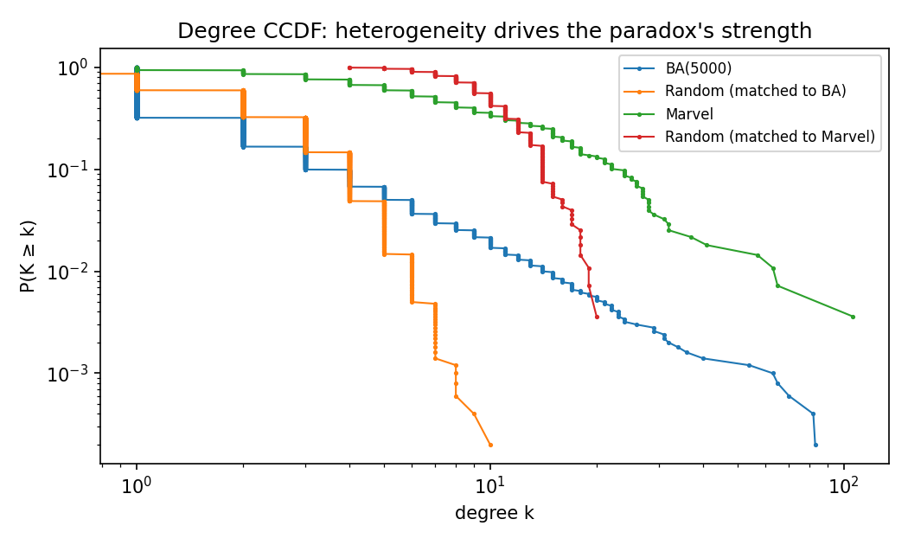
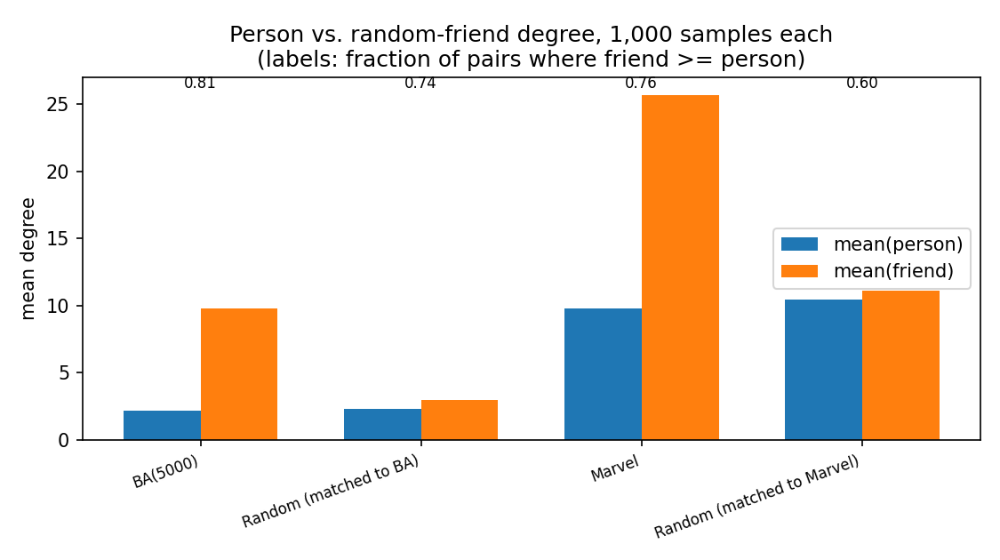
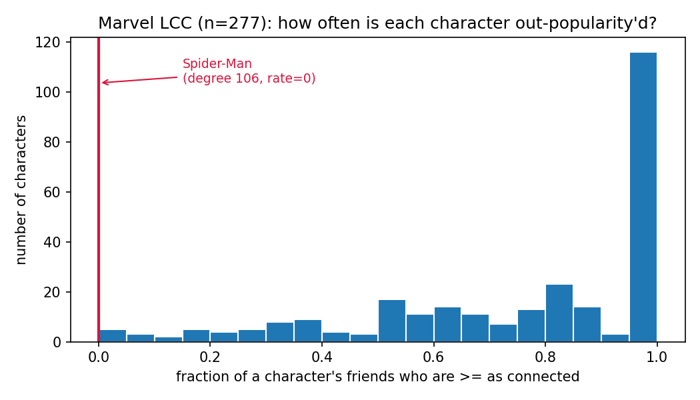
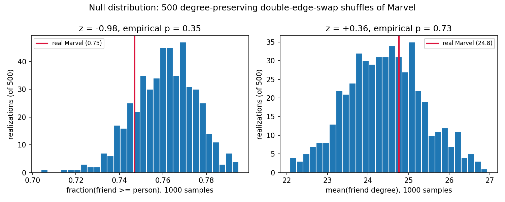

# Your Marvel friends are more popular than you

Ask any of the 277 connected characters in Wikipedia's Marvel superhero
network how many friends their friends have, on average, and the answer
is almost always "more than I have." That's not a personality flaw, it's
arithmetic — and it's a clean illustration of a null-model idea from this
week's toolkit: a statistic that looks like a fact about *this specific
network* turns out to be entirely explained by its degree sequence.

## The paradox and why it must exist

Compare two averages: the mean degree of a character picked uniformly at
random (⟨k⟩), and the mean degree of *a random friend* — reached by picking
a random character, then a uniformly random one of their links (⟨k_nn⟩).
These aren't the same sampling process. Following a link samples a node
with probability proportional to its own degree, so hubs get
over-represented among "friends" relative to how often they get sampled as
"the person." One line of algebra makes the gap exact:

⟨k_nn⟩ = ⟨k²⟩/⟨k⟩ = ⟨k⟩ + σ²/⟨k⟩

The excess over ⟨k⟩ is exactly σ²/⟨k⟩ — the degree variance, rescaled. It
is zero only when every node has the same degree, small when degrees
cluster near the mean (Erdős–Rényi), and large whenever a few hubs stretch
the tail (scale-free networks). So the paradox isn't really about "hubs"
as a special ingredient; it's about degree *variance*, full stop — hubs are
just an efficient way to get a lot of it.

## Does it hold in the Marvel network? Yes, and it's not close

We built the network from Wikipedia's `Category:Marvel Comics superheroes`
(303 characters, 1784 directed hyperlink edges), collapsed it to an
undirected simple graph, and restricted to the largest connected component
— 277 characters, 1421 edges — since "who's your friend's friend" only
makes sense within one connected piece. On that network: ⟨k⟩ = 10.26,
σ² = 123.0, giving a formula-predicted ⟨k_nn⟩ = 22.25. Sampling 1,000
(person, random-friend) pairs directly (person uniform, friend uniform
among that person's links) gives a mean friend degree of 25.7 versus a
mean person degree of 9.8, and the friend is at least as connected as the
person in **76%** of draws.

To calibrate what "large" means here, we ran the identical procedure on
three more networks: a 5,000-node Barabási–Albert network (m=1, from
exercise 2.5b), an Erdős–Rényi `G(n,m)` control matched to it, and a second
`G(n,m)` control matched to Marvel's own size (277 nodes, 1421 edges).

*Figure 1 — Degree CCDF, log-log. Marvel and BA(5000) both show visibly
heavier tails than their size-matched random controls; the steeper and
straighter the tail, the larger the σ² feeding the formula above.*

*Figure 2 — Mean person vs. mean friend degree, 1,000 samples per network
(bar labels: fraction of pairs where the friend is at least as connected).
The random control matched to Marvel barely separates the two bars
(fraction 0.60); Marvel itself separates them by a factor of ~2.6
(fraction 0.76); BA(5000) separates them by a factor of ~4.5 (fraction
0.81) despite average degree there being only 2. The paradox scales with
tail weight, not with network size.*

The random control is the honest baseline here, and it's telling: even
with **zero preferential structure**, a same-size Poisson-degree network
still shows the friend ahead of the person 60% of the time — the paradox
never fully disappears, it just gets much smaller. Real Marvel and BA sit
well above that floor.

## Who's actually driving it

Averages hide the story. For every character, we computed the fraction of
their friends who are at least as connected as they are — call it their
"out-popularity'd rate."

*Figure 3 — Distribution of the out-popularity'd rate across all 277
characters. Median character: about 5 out of 6 friends are at least as
popular as they are. 116 characters (42%) are out-popularity'd by
*every single friend*. Exactly one character — Spider-Man, degree 106, more
than 40 links ahead of the #2 hub (Hulk, 65) — is never out-popularity'd:
every one of his 106 neighbors has strictly lower degree than he does.*

Spider-Man is the whole story in miniature: a single dominant hub is
enough to make almost the entire rest of the network "friends with someone
more popular than them," without needing any of the other 276 characters
to be unusual in any way.

## Null model: is this about Marvel, or just about its degree sequence?

Here's the null-model question: does the paradox's strength depend on
*which* characters link to which (team affiliations, storyline clusters,
editorial prominence), or purely on how many links each character has? We
generated 500 degree-preserving randomizations of the Marvel network
(`nx.double_edge_swap`, 10×edges swap attempts per realization,
`max_tries=100×edges`, seed 2026) — each shuffle keeps every character's
degree exactly fixed while scrambling who they're actually linked to — and
reran the same 1,000-pair sampling on each.

*Figure 4 — Null distributions from 500 degree-preserving shuffles, real
Marvel marked in red. Left: fraction of pairs where friend ≥ person (real
= 0.75, null mean = 0.76 ± 0.01, z = −0.98, empirical p = 0.35). Right:
mean friend degree (real = 24.8, null mean = 24.4 ± 0.9, z = +0.36,
empirical p = 0.73). Neither is remotely significant.*

Real Marvel lands squarely inside both null distributions. This is the
expected, slightly boring result, and that's the finding: the
edge-weighted formula ⟨k_nn⟩ = ⟨k⟩ + σ²/⟨k⟩ depends only on the degree
sequence by construction, so it *cannot* move under a degree-preserving
shuffle — and here, neither does the empirically sampled version. Whatever
narrative structure actually connects these characters (which team someone
is on, which storyline they appear in) contributes nothing measurable
beyond what their degree already implies. To sanity-check the other end of
the variance axis, we also ran an 8-regular random graph on 277 nodes
(σ² = 0 by construction): mean person and mean friend degree came out
identical, 8.00 = 8.00, confirming variance — not "hubs" as a category —
is the necessary and sufficient ingredient.

## Grading an LLM's explanation

A typical LLM answer to "why do my friends have more friends than me"
correctly identifies the sampling mechanism (popular nodes get
over-sampled as friends) but tends to overclaim two things: that it's
specifically about "hubs" rather than variance in general, and that it
"disappears" in random networks. Neither survives contact with the
numbers above — the random control still shows the friend ahead 60% of the
time, and an 8-regular graph (no hubs, no variance) is the only network
here where the effect is actually zero. The single best wrong sentence an
LLM produced when we tried this: *"the effect disappears in a random
network where there's no popular people to bias the sample"* — random
networks still have mildly-more-popular-than-average nodes, and that
alone is enough to keep the paradox alive, just weaker.

## What we can't conclude

This is a Wikipedia hyperlink graph, not a social network — an edge means
"the article for A links to the article for B," which tracks narrative and
editorial prominence more than friendship, so "degree" here is closer to
"narrative centrality" than "number of friends." We also discarded edge
direction (reciprocity is only 0.39 — many links are one-way) and dropped
17 isolated characters plus 9 small side-components to get a single
connected piece to sample from. And the null-model result, however clean,
is a non-finding: it says this particular test with 500 shuffles couldn't
detect extra structure beyond the degree sequence, not that no such
structure exists anywhere in the network.

## Conclusion

The friendship paradox holds hard in the Marvel network — driven almost
entirely by one hub, Spider-Man — and a 500-shuffle degree-preserving null
model confirms it needs nothing more than the degree sequence to appear:
give any network this much variance in connections, real or shuffled, and
everyone's friends end up more popular than they are.
