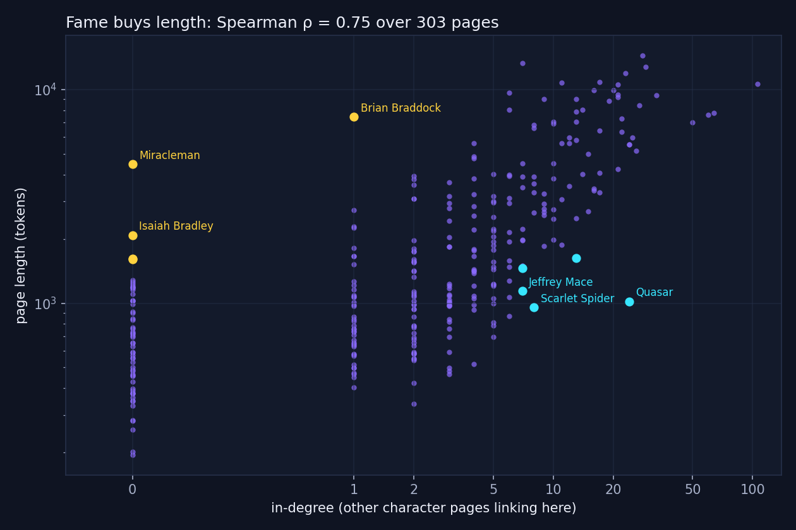
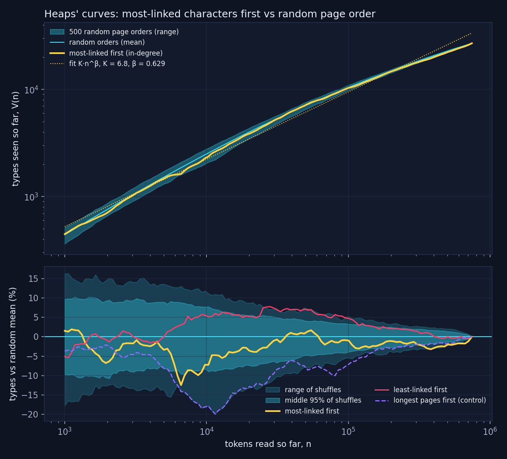
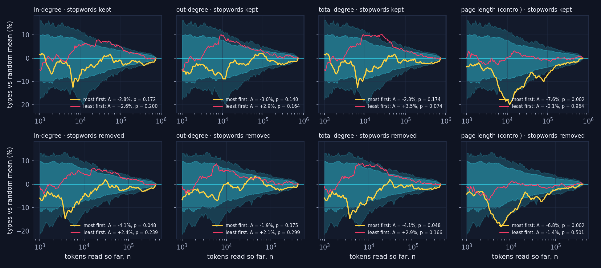

# Fame buys length, not new words — does fame buy you words?

*Week 5 · The language half · exercise 5.9, "Go nuts with your LLM" (openers 5 and 6, combined).*
Interactive version: [weeks/week5.html](../week5.html) · exploration and validation: [week5_gonuts.ipynb](week5_gonuts.ipynb) ·
pipeline: `scripts/week5_analyze.py` → `data/processed/week5.json`.

For four weeks the Marvel characters were dots with links between them. This week each dot is also a Wikipedia article. The
best-linked characters have the longest articles. The question here is narrower: do their pages bring new words any faster
than anyone else's, or are they only longer?

**Corpus, unless stated otherwise:** all 303 pages of `marvel_pages.zip` (the course's frozen 2026-08-26 snapshot).
**Tokenizer, unless stated otherwise:** spaCy `en_core_web_sm` tokenizer, lowercased, punctuation and whitespace tokens dropped,
stopwords kept: **744,495 tokens, 26,987 types, 9,723 of them used once** (36%). **Network:** the directed Week 1 network, 1,784
links between the same 303 pages.

Every number below comes from `week5.json`, and every number we had already worked out in `week5/exercise_5_3.ipynb` reproduces
exactly (the page's sanity table lists them side by side).

---

## 1 · The hook: more links in, more words on the page

*Corpus: 303 pages. Length: spaCy tokens, stopwords kept. In-degree: directed Week 1 network. Horizontal axis linear up to 1 and
logarithmic beyond; vertical axis logarithmic. No line is fitted.*

Both variables are badly skewed (median page 1,261 tokens, longest 14,469; 58 pages have no incoming link, Spider-Man has 106), so
the correlation is Spearman's: **ρ = 0.75** for in-degree, 0.78 for out-degree, 0.83 for total degree. Pearson's r on the raw
counts would be 0.66. We don't use it.

The pages furthest from the relationship, measured in ranks to match the statistic, and what we found when we read them:

| | In-degree | Tokens | What the page is |
|---|---|---|---|
| **Long for their in-degree** | | | |
| Miracleman | 0 | 4,471 | British character first published in 1954, only later at Marvel. Mostly publication history. No links in or out. |
| Brian Braddock | 1 | 7,446 | Captain Britain. Long British and American publication history. Only his sister's page links here. |
| Isaiah Bradley | 0 | 2,085 | One of several holders of the Captain America title. |
| **Well linked but short** (top quarter by in-degree) | | | |
| Quasar | 24 | 1,020 | "The name of several superheroes": a shared-name page with a short biography per bearer. |
| Scarlet Spider | 8 | 956 | "An alias used by several fictional characters": another name page. |

Both lists are about how Wikipedia is written. In-degree counts mentions by the other 302 pages. Length counts how much editors
found to say. These are the places where the two part ways.

## 2 · Length is not vocabulary

Types grow with tokens on any text, so the correlation between in-degree and a page's type count (ρ = 0.75) is the length
correlation over again. To compare vocabularies every page needs the same token budget, and there are two fair ways to hand one
out:

| Spearman ρ, in-degree vs number of types | 500 tokens (272 pages) | 1,000 tokens (193 pages) |
|---|---|---|
| all types on the page, no control | +0.72 | +0.68 |
| budget drawn at random from the whole page (exact expectation) | +0.44 | +0.45 |
| budget taken as tokens in a row (mean of 20 windows) | −0.12 (p = 0.048) | −0.02 (p = 0.73) |

A scattered sample from a long page touches more sections, so it looks richer. A continuous passage doesn't. "Richer vocabulary"
has no single answer even after controlling for length. The question with one answer is about the corpus as a whole: as pages are
added, how fast does the vocabulary grow, and does it matter who goes first?

## 3 · The figure: read the famous first, then shuffle the pile

*Corpus: 303 pages, 744,495 spaCy tokens, stopwords kept. Yellow: pages concatenated most-linked first (in-degree, ties
alphabetical). Band: 500 uniformly random page orders, seed 42 (full range, and the middle 95% in the lower panel). Fit: V = K·n^β by
least squares on log V against log n at 120 log-spaced n from 1,000 to 744,495. Lower panel: each curve as a percentage of the
shuffles' mean.*

**The exponent doesn't care who goes first.** Most-linked first: **β = 0.629** (K = 6.81, R² = 0.992). 500 random orders: **β = 0.625
± 0.008** (0.599–0.648; K = 7.28 ± 0.73). Against the shuffles, p = 0.64. Least-linked first: 0.629.

**The level: inside the band, along its lower edge.** Fame-first runs **2.8% below** the random mean on average; a random order
typically sits ±2.0% from it, so over the whole curve this isn't distinguishable from chance (**p = 0.17**). Point by point it is below
the middle 95% of shuffles at 21 of 120 values of n, mostly late, and never above. Read backwards, the picture mirrors (+2.6%,
p = 0.20).

**What does bend the curve is length.** Longest page first: **−7.6%, p = 0.002**, below the middle 95% at 77 of 120 points. A long page
reuses its own words, so a few long pages cover less vocabulary than many short ones. In-degree order is partly a length order, which
is the likeliest reason for its small deficit.

**The pages nobody links to.** The last 58 pages in the fame-first order have in-degree 0 and hold 46,347 tokens (6.2%).

| Read last | New types |
|---|---|
| the 58 unlinked pages | **1,104** |
| a random final stretch of the same 46,347 tokens (500 shuffles) | 734 ± 72 (at most 931) |
| 58 pages of matching length (in-degree shuffled within length deciles, 500 shuffles) | 790 ± 55 (at most 955) |
| the shortest pages, same number of tokens | 779 |

So minor characters don't mostly repeat the famous ones. They add about 40% more new types than equally short pages in the same
position (p ≈ 0.002, the smallest value 500 shuffles can give). We read what they add: Miracleman (161 new types: *miracleman,
marvelman, moran*), Baymax (55: *baymax, synthformer*), Detroit Steel (45). Names and places from outside the shared universe, which
is also why nobody links there.

## 4 · Robustness

Each curve against its own 500-shuffle band. Curves with different stopword settings are never laid over each other: removing
spaCy's stopwords deletes 44% of the tokens (416,525 left, 26,685 types), so n no longer means the same thing.

| Page order | β, stopwords kept | avg gap (p) | β, stopwords removed | avg gap (p) |
|---|---|---|---|---|
| 500 random orders | 0.625 ± 0.008 | ±2.0% | 0.634 ± 0.010 | ±2.1% |
| most-linked first (in-degree) | 0.629 | −2.8% (0.17) | 0.647 | −4.1% (0.048) |
| least-linked first | 0.629 | +2.6% (0.20) | 0.636 | +2.4% (0.24) |
| most outgoing links first | 0.634 | −3.0% (0.14) | 0.641 | −1.9% (0.38) |
| fewest outgoing links first | 0.625 | +2.9% (0.16) | 0.633 | +2.1% (0.30) |
| highest total degree first | 0.629 | −2.8% (0.17) | 0.648 | −4.1% (0.048) |
| lowest total degree first | 0.625 | +3.5% (0.07) | 0.632 | +2.9% (0.17) |
| longest page first (control) | 0.634 | **−7.6% (0.002)** | 0.649 | **−6.8% (0.002)** |
| shortest page first | 0.626 | −0.1% (0.96) | 0.640 | −1.4% (0.50) |

No curve has a β the shuffles would find unusual (smallest p: 0.15). For the level, only page length clears the band in both
settings. Removing stopwords widens the in-degree gap to −4.1% (p = 0.048), but out-degree stays well inside, and with 16 curves
tested one or two borderline p-values are what chance gives. We read it as a lean, not a result. Random tie-breaks in the in-degree
order move the gap by less than 0.05 percentage points.

## 5 · Where the code and the text disagreed

| What we counted | Tokens say | Raw text says | Where they part |
|---|---|---|---|
| `power`, all 303 pages (spaCy) | 820 | 821 | Doctor Spectrum's page: *the "Wellspring of Power"—an interdimensional source…* spaCy kept `Power"—an` as one token. |
| `symbiote` on Eddie Brock's page (CountVectorizer) | 152 | 155 | `symbiote-empowered`, `human-symbiote`, `symbiote-possessed`: our pattern keeps hyphenated words whole. |
| the 9,723 types used once (spaCy) | 9,723 | 75 are there more than once | `uncannyxmen`: one token, 17 times in the text, the rest inside `uncannyxmen.net`. |
| a word glued to punctuation (spaCy) | 49 types, 47 used once | 0 words | `power"—an`, `girl"—a`, `gold"—led`, … each a step up on the Heaps curve. |

**The rule this leaves us with:** when a raw-text regex and a tokenizer disagree, the text wins, and a number derived from tokens is
only as good as the tokenizer's rules for the case at hand. For the figure it changes little (49 glued types are 0.18% of the
vocabulary, under any page order). The height of the curve is another matter: 26,987 types under spaCy, 27,583 under our
CountVectorizer pattern, for the same pages.

One more thing the text told us: five `name` values in `week1_nodes.tsv` belong to a different article than their node
(`Doctor_Spectrum` is listed as "Alice Nugent"), so pages are labelled by node id throughout.

## 6 · What we can and can't conclude

**Can.** In-degree and page length rise together (ρ = 0.75). Reading most-linked first gives the same Heaps exponent as a random order
and a curve 500 shuffles can't separate from chance overall. The 58 unlinked pages add more new types at the end than any of 500
length-matched alternatives.

**Can't.** That famous characters "have a richer vocabulary": at an equal 500-token budget the correlation is +0.44 or −0.12 depending
on how the tokens are picked. That fame causes length: both are editors' choices, and in-degree only counts links from the other 302
pages of one category. That any of this is about the comics. And that Heaps' law "holds": the log–log line fits well but the curve
bends (β = 0.72 on the first half of the grid, 0.51 on the second), so our β is an average over a stated range.

**Grading the LLM.** We asked an LLM (Claude) for a confident paragraph arguing that famous characters have richer vocabularies, given
three numbers. It compared raw type counts on pages of 14,469 and 195 tokens, read the type–in-degree correlation as richness (it is
the length correlation), presented one ordering's β as evidence with no null (random orders give the same β), used "vocabulary" to
mean length, and never said how words were counted. The page has the paragraph and the claim-by-claim marks.

**With another week.** The random-order band asks whether the order matters at all; it can't say whether fame matters once length is
accounted for, and reading a band by eye isn't a test. We'd rerun the whole curve under the length-matched shuffle we used for the
tail and compare β and the average gap with that distribution, pairing each permutation with the real order on the same grid of n.

**Bottom line.** More links, more words, same curve. Fame buys a character a longer page. The new words come from the edge of the
network.

---

*A toy, not a finding:* the page ends with the exercise's third opener, a Bag-of-Words search box over the 303 pages (cosine
similarity on raw counts, optional stopword removal). It demonstrates the representation and is evidence for nothing above.
